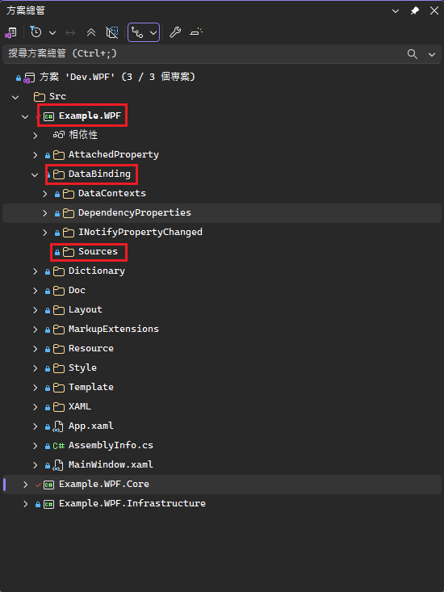
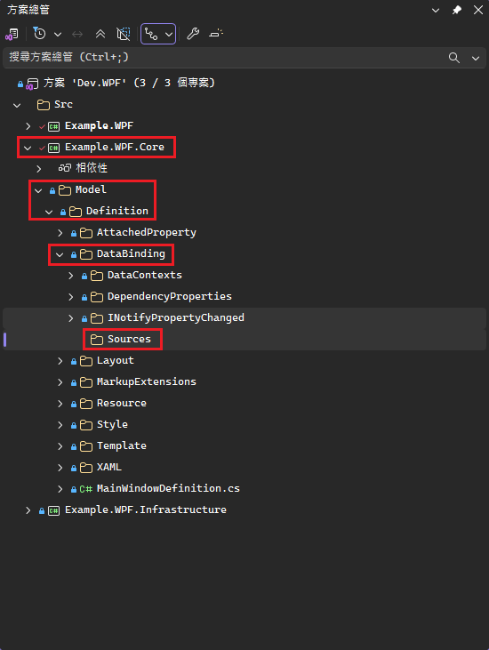
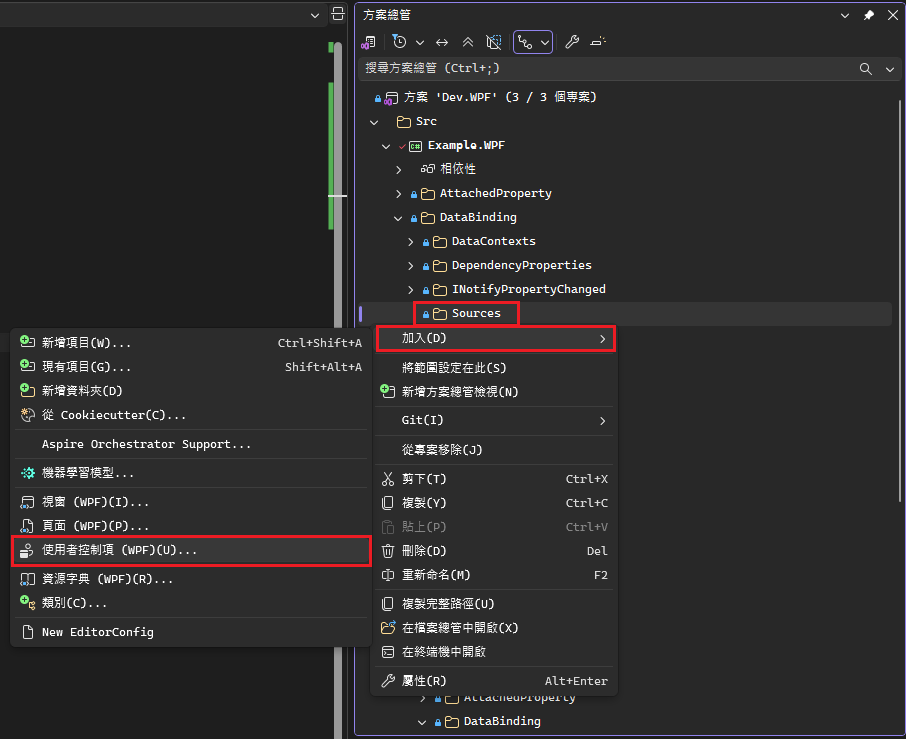
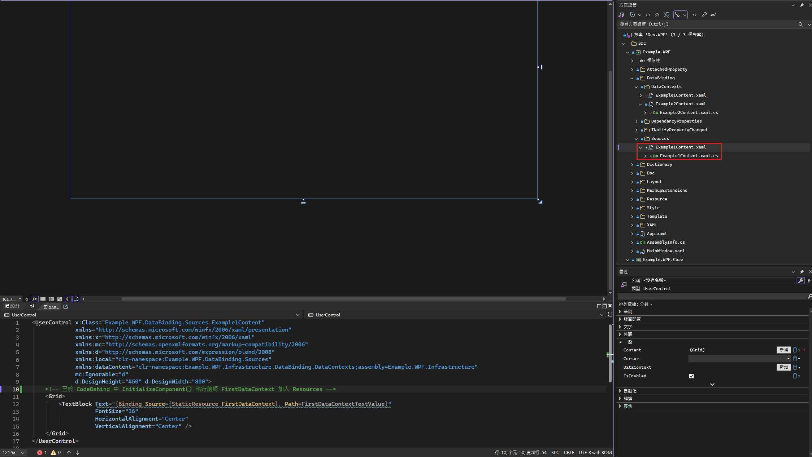
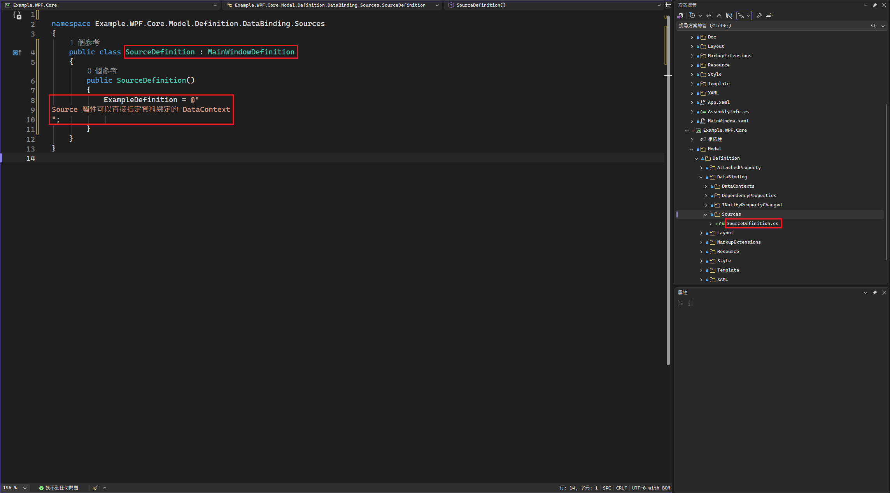
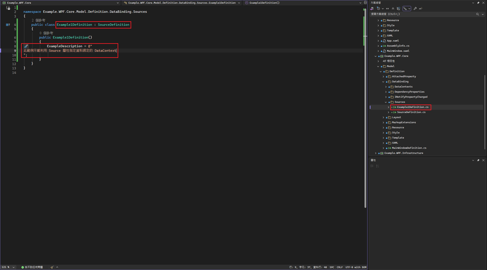
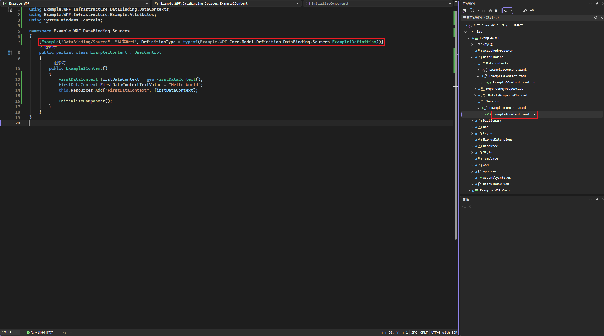
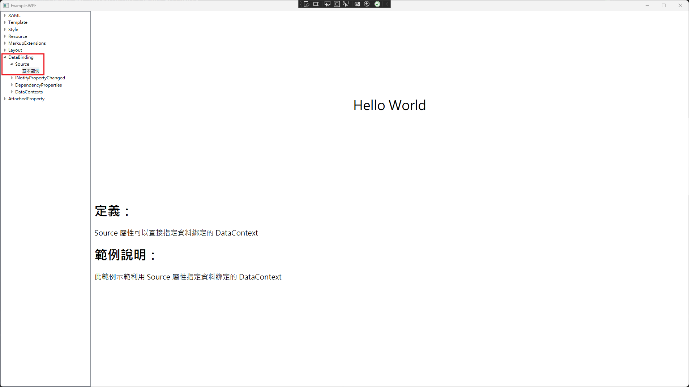

# 新增範例步驟
## 以下示範於 DataBinding 群組中新增 Source 範例
1. 於 Example.WPF 的 DataBinding 群組中新增 Sources 資料夾用於存放範例的 Content
    - 注意: 如果資料夾名稱與該範例名稱衝突，會導致命名空間衝突問題，目前解法為使用複數命名(如 DataContexts)
    - 
2. 於 Example.WPF.Core 的 Model.Definition 中新增 Sources 資料夾用於存放範例的 Definition
    - 
3. 新增範例的 Content
    - 於 Example.WPF 中新增使用者控制項，並實作範例
    - 
    - 
4. 新增範例的定義類別
    - 於 Example.WPF.Core 中新增該範例定義的類別，並繼承 MainWindowDefinition
    - 將範例的定義說明於建構子中放入 MainWindowDefinition.ExampleDefinition
    - 
5. 新增範例的描述類別
    - 於 Example.WPF.Core 中新增該範例定義的類別，並繼承剛剛建立的定義類別
    - 將該範例的描述於建構子中放入 MainWindowDefinition.ExampleDescription
    - 
6. 範例 CodeBehind 加入 ExampleAttribute
    - ``[Example("[範例所屬群組]/[範例類別]", "[此範例名稱]", DefinitionType = typeof([範例描述類別的命名空間]))]``
    - 
## 結果
- 